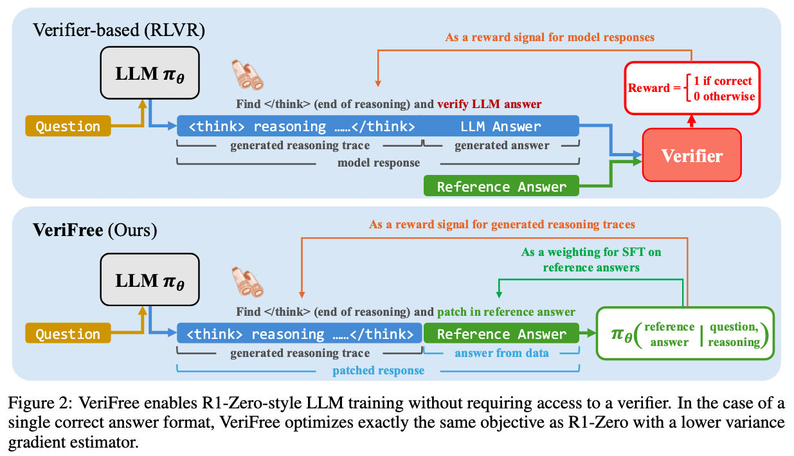

<div align="center">

# VeriFree: Reinforcing General Reasoning without Verifiers
[Xiangxin Zhou*](https://scholar.google.com/citations?hl=en&user=eQgIWcQAAAAJ), [Zichen Liu*](https://lkevinzc.github.io/), [Anya Sims*](https://anyasims.github.io/), [Haonan Wang](https://charles-haonan-wang.me/), [Tianyu Pang](https://p2333.github.io/)

[Chongxuan Li](https://zhenxuan00.github.io/), [Liang Wang](https://scholar.google.com.hk/citations?user=8kzzUboAAAAJ), [Min Lin](https://scholar.google.com.sg/citations?user=BGONmkIAAAAJ&hl=en), [Chao Du†](https://duchao0726.github.io/)

*Equal contribution, †Correspondence

</div>

<p align="center">
  📚 <a href="https://arxiv.org/abs/2505.21493">[Paper]</a> |
  🤗 <a href="https://huggingface.co/collections/zhouxiangxin/verifree-685a1e9509d0db2ed9731c62">[Checkpoints]</a>
</p>

## Overview




## Usage
### Dependency

The code has been tested in the following environment: 

```
conda create -n VeriFree python=3.10 -y
conda activate VeriFree

pip install torch==2.5.1 torchvision==0.20.1 torchaudio==2.5.1 --index-url https://download.pytorch.org/whl/cu121
pip install oat-llm==0.1.3

# PATH_TO_YOUR_USER_DIRECTORY in the following command should be modified 
export LD_LIBRARY_PATH=$LD_LIBRARY_PATH:{PATH_TO_YOUR_USER_DIRECTORY}/.conda/envs/VeriFree/lib/
```

### Training

The following command is an example for fine-tuning Qwen3 base models by VeriFree policy optimization:

```
bash run.sh
```


## Acknowledgements

- We use [oat](https://github.com/sail-sg/oat) as the training framework.
- Our model is trained on top of [`Qwen3`](https://huggingface.co/collections/Qwen/qwen3-67dd247413f0e2e4f653967f).


## Citation
If you find our work useful for your research, please consider citing:

```bibtex
@article{zhou2025verifree,
  title={Reinforcing General Reasoning without Verifiers},
  author={Zhou, Xiangxin and Liu, Zichen and Sims, Anya and Wang, Haonan and Pang, Tianyu and Li, Chongxuan and Wang, Liang and Lin, Min and Du, Chao},
  journal={arXiv preprint arXiv:2505.21493},
  year={2025}
}
```


